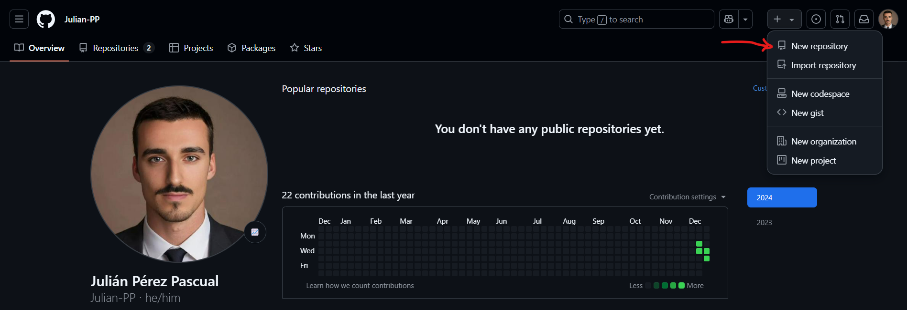
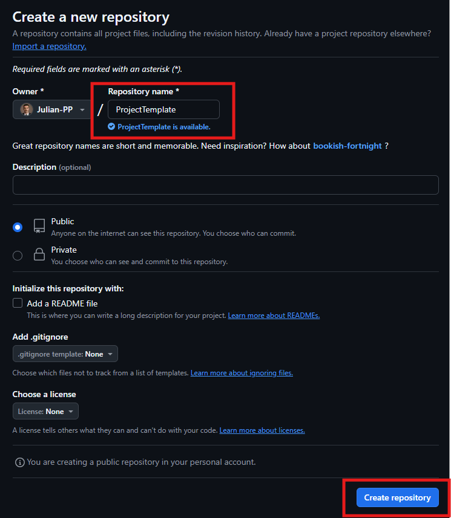
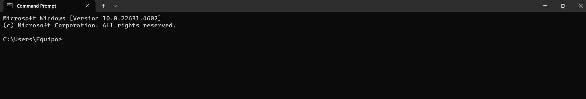
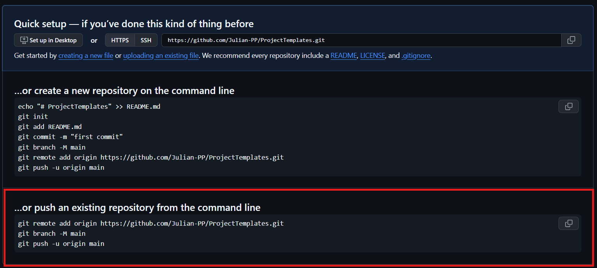

# PROJECT TEMPLATE


This is a project working as a general template for AI projects, so we can easily initialize new projects whenever needed, using a formal and practical structure.

<br></br>

## INSTALLATION GUIDE


A quick guide to be able to create a new repository in GitHub to start working effectively.
<br></br>

### GitHub repository (cloud-base)


to create a new repository in GitHub follow the next steps:

1. Click on *new repository* in the drop-down list:


<br></br>

2. Add a project name and click on *create repository*:


**Take into account that you can either select public or private repository, depending on your privacy policy.**
<br></br>

### Git Repository (local-base)

Here we will give some tips to initialize a new repository in your local GIT. First of all you will need to open your bash terminal, and connect to your GitHub account following the next steps:

1. Open the terminal:


--

2. Open the configuration file for GitHub:
```python
    git config --global -e
```
--

3. Add your own personal data (username, email and GitHub password).

--

4. Close the configuration file pressing "ESC" button and runnning the following command:
```python
    :wq!
```

Once you have done it, follow the next command steps:

1. Move to the path where you want to create your project repository:
```python
    cd file_path
```

--

2. Create a local folder where the project will be stored:
```python
    mkdir folder_name
```

--

3. Move to the folder you have just created:
```python
    cd folder_name/
```

--

4. Initialize repository (it will create a .git folder to start tracking changes):
```python
    git init
```
 
--

5. Connect the GitHub repository with your local one, copying this into the terminal:

<br></br>
## FIRST STEPS


Once we have both repositories created and connected, we can start with some best-practice steps.

### Readme.md file

A README file is one of the core basis of a GitHub project, as it contains all necessary information for everyone to be able to understand what the project is about. We may remember at this point that GitHub is supposed to be a colaborative place for programmers to engage into coding projects, therefore it is essential to be transparent with all the information stored in the repository:
```python
    echo "# ProjectTemplates" >> README.md
```

As best-practice, it is highly recommended to commit every important change you make in the system, so you have a version history that you can bring back any moment you want, avoiding future problems:
```python
    git add README.md
    git commit -m "commit message"
```

README is a **markdown** file, which means we can use this language to create a practical and visual framework. Remember that this file is the **presentation card** of the project, so take care of the small details. Here you have a markdown manual:
<br></br>
🔗 [Markdown reference](https://commonmark.org/help/)
<br></br>

**VISUAL CODE RECOMMENDATION**: install the following extension if you want to have a GitHub preview of the markdown file before pushing it to the cloud repository:
<br></br>
🔗 [Markdown Preview Github Styling](https://marketplace.visualstudio.com/items?itemName=bierner.markdown-preview-github-styles)


### .gitignore file

This file is a GitHub controller, where you can store the extensions, files, folders... which you do not want to be uploaded into the repository. It may be because of its size, privacy policy...

To create a .gitignore file we will run the following command in the terminal:
```python
    echo "# Text to be added to the file (optional)" > .gitignore
```

As good-practice, there is an online .gitignore file generator which can be used to generate specific ones depending on your needs. For instance, we will generate a python project file:
<br></br>
🔗 [.gitignore generator](https://www.toptal.com/developers/gitignore)

### Requirements.txt file

This file is very important as it contains all the libraries and dependencies that are necessary to execute the code. To create it, run the following command in the terminal:
```python
    echo "# File to store all libraries and dependencies to be able to execute the code" > requirements.txt 
```


### Folders

It is important to follow a general architecture of folders to work effectively. In the case of an AI project, the structure will be the following one (this is, of course, up to you):
```python
    mkdir data diagrams docs env models modules notebooks tests
```
The different folders created work as follow:
- **data**: place to store source data (datasets, media items, files...) which may be helpful to create our model.
- **diagrams**: place to store visual flow diagrams that make the architecture simpler to understand.
- **docs**: place to store files such as manuals, articles... which have no direct relationship with the code but may help us achieve our goals.
- **env**: place to create our python environment with all its dependencies and libraries.
- **models**: place to store trained models, ready to be deployed.
- **modules**: place to store .py files, encampsulating the main code.
- **notebooks**: place to store jupyter notebooks. They are typically the previous phase of the modules, where you, as a programmer, work until you get the right functionality and translate it into a python file.
- **tests**: place to do your own testing freely, without worrying about organization, neither messing up.

From this point, you can freely manage your subfolders depending on your business context.


### Python environment

The next step, previous to start working on the project, is to create a virtual python environment. The idea behind is to create an specific environment for the project, with the right dependencies and libraries. In other words, we just want to store the information needed to execute the program. To do so, run the following code:
```python
    python -m venv env
```

<br></br>

> At this point, we are ready to start the project. Have fun!